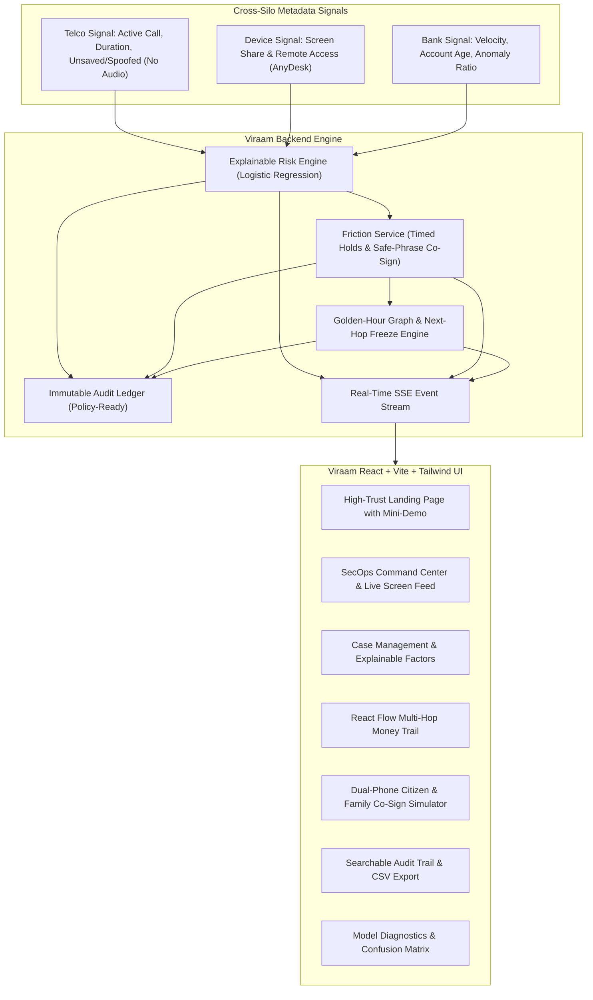

# VIRAAM (विराम)

> **Tagline:** *Pause the panic. Protect the payment.*  
> **Mission:** Stop "digital arrest" scams at the moment of payment, and trace funds through mule accounts before cash-out.

---

## 1. The Problem

In digital arrest scams, fraudsters pose as law enforcement (CBI, ED, Cyber Police) via video or voice calls, psychologically isolate the victim ("do not speak to anyone or you will be detained"), and coerce large fund transfers within minutes.

Call-level defenses (spam filters, account bans) fail because scammers easily rotate SIMs, spoof official caller IDs, or pivot to VoIP platforms. The core gap is structural:
- **The Telco** sees the 40-minute call with an unsaved number, but has no visibility into banking transactions.
- **The Bank** sees a high-value transfer authorized with a valid biometric or PIN, but has no context on the psychological coercion.
- **Inter-Bank Freezes** take days to coordinate through manual complaints, while scam syndicates fan funds out across layered mule rings into Crypto P2P desks or ATM grids in under 25 minutes.

---

## 2. The Solution (Three Layers)

1. **Cross-Silo Risk Signal:** Merges call state metadata (active long call, unsaved caller), device telemetry (AnyDesk/TeamViewer remote access or screen sharing), and recipient mule signals (first-time beneficiary, rapid inbound velocity) into an explainable 0–100 risk score. **Zero call audio is ever accessed or recorded.**
2. **Coercion-Breaking Friction:** For critical-risk transfers, triggers a timed 15–30 minute cooling-off pause, delivers a calm, plain-language interruption that pierces the scammer's false authority, and requires a **family safe-phrase co-sign** using a rotating 2-word TOTP secret.
3. **Golden-Hour Mule Tracing:** Automatically constructs a multi-hop NetworkX fund propagation graph (Victim → Layer 1 Mule → Aggregators → Dispersal), predicts downstream branch exit destinations, and generates an actionable **Freeze Plan** ranked by expected recoverable value.

---

## 3. System Architecture



---

## 4. Honest Limitations & Safety Rules

- **All Data is Synthetic:** Generated via reproducible algorithms with natural noise and overlap. No real PII or live bank credentials are used.
- **Simulated Call Context:** Adheres to privacy-by-design. Zero voice audio is ever recorded, transcribed, or processed. Signals consist strictly of OS-level call metadata.
- **No Real Bank/UPI Integration:** Demonstrates modern protocol compatibility via simulated payment flows.
- **Policy-Ready, No Legal Authority:** Holds are designed as consent-based, time-limited consumer cooling-off periods mapping to future digital financial protection mandates.

---

## 5. Technology Stack

- **Backend:** Python 3.11+, FastAPI, Uvicorn, Pydantic v2, SQLModel + SQLite, NetworkX, scikit-learn (`LogisticRegression`), NumPy, Pandas, Faker, `sse-starlette`, pytest.
- **Frontend:** Vite, React 18, Strict TypeScript, Tailwind CSS, React Router v6, TanStack Query v5, Zustand v4, Framer Motion, Recharts, `@xyflow/react` (React Flow), Lucide React.
- **Styling:** Bespoke design system with Dark-first palette (`#0A0B0F` background, `#11131A` surface, `#F5B84B` Pause Amber accent), hairline borders, and warm light mode toggle.

---

## 6. Quick Start

### Prerequisites
- Python 3.11+
- Node.js 18+ and npm

### One-Command Setup & Launch
```bash
# Clone the repository
cd VIRAAM

# Backend Setup
python -m venv .venv
.venv\Scripts\pip install -r backend\requirements.txt

# Frontend Setup
cd frontend
npm install --legacy-peer-deps
cd ..

# Run both servers
# Option A (Windows PowerShell):
make dev

# Option B (Manual):
# Terminal 1 (Backend):
cd backend && ..\.venv\Scripts\python -m uvicorn app.main:app --reload --port 8000
# Terminal 2 (Frontend):
cd frontend && npm run dev
```

Visit the application at:
- **Landing Page:** [http://localhost:5173](http://localhost:5173)
- **SecOps Workspace:** [http://localhost:5173/workspace](http://localhost:5173/workspace)
- **Interactive Simulator:** [http://localhost:5173/workspace/simulator](http://localhost:5173/workspace/simulator)
- **API Documentation (Swagger):** [http://localhost:8000/docs](http://localhost:8000/docs)

---

## 7. Running Backend Tests

```bash
cd backend
..\.venv\Scripts\pytest -v
```

All 6 test suites verify:
1. Critical scam scoring producing hold and co-sign recommendations.
2. Legitimate transfer false-positive suppression staying below high band.
3. Hold lifecycle transition states (`held` → `released`/`resolved`).
4. Rotating safe-phrase generation and family approval/denial resolution.
5. Freeze plan ordering strictly prioritized by $E[\text{Recoverable}] \times P \times \text{Urgency}$.
6. Audit ledger persistence for regulatory compliance.
